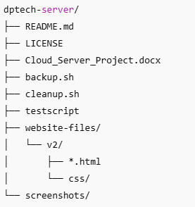

# Cloud Server Project: dptech.online

**Student:** Diego Pedraza  
**Student ID:** 35549445  
**Unit:** ICT171 - Server Environments and Architectures  
**Project Name:** dptech.online  
**Project Type:** Cloud-hosted IT services website with secure access, scripting automation, and cost analysis  
**Primary Domain:** https://dptech.online  
**Replica/Test Domain:** https://dptech2.online

## Project Purpose and Scope

This cloud infrastructure project aimed to deploy a fully operational IT services website, **dptech.online**, using Amazon Web Services (AWS) EC2 to simulate a real-world business scenario. DPTech provides diverse services, such as hardware repairs, virus removals, data recovery, networking assistance, and cloud IT consulting. The solution was designed to be secure, cost-effective, and scalable with automated tasks to simulate a professional-grade cloud deployment. The scope involved registering a domain, configuring DNS records, launching a Linux EC2 instance, installing and configuring a web server, implementing TLS encryption, scripting backup procedures, automating tasks with cron, and documenting total cost of ownership over three years. Each step was carried out with a focus on reproducibility, allowing the server to be redeployed independently in the future.

## Cloud Infrastructure Overview

| **Element** | **Detail** |
|-------------|------------|
| **Platform** | AWS EC2 – IaaS |
| **Instance Type** | t3.micro (Free Tier eligible) |
| **OS** | Ubuntu Server 24.04 LTS |
| **Elastic IP (Main)** | 3.107.180.255 |
| **Elastic IP (Test)** | 13.237.145.105 |
| **Security Rules** | TCP: 22 (SSH), 80 (HTTP), 443 (HTTPS) |

## Local Machine Setup

- **Operating System**: Windows 11
- **Terminal Tool**: MobaXterm
- **SSH Key File**: D:\amazon\diegokey.pem
- **Website Files Folder**: D:\amazon\webEC2
- **Git Client**: GitHub Desktop
- **Git Files Folder**: D:\github\dptech-server

## Domain Configuration

Domains registered on [Namecheap](https://www.namecheap.com/) and configured as follows:

| **Domain** | **IP Address** | **SSL** | **Purpose** |
|------------|----------------|---------|-------------|
| dptech.online | 3.107.180.255 | ✅ | Production server |
| dptech2.online | 13.237.145.105 | ✅ | Replica Test server for documentation |

📌 Both domains use A records pointing to their respective public Elastic IPs.

# Hosting Platform: Amazon EC2

Amazon EC2 (Elastic Compute Cloud) was selected for this project due to its flexibility, affordability, and industry relevance.

**Step-by-Step Configuration:**


- http://aws.amazon.com/ec2/

Or console page:

- https://console.aws.amazon.com

- Logged into AWS Console and selected EC2 from the Services menu.
- Launched a new instance
- Name and tags, name: DiegoServer-EC2 (DiegoServer2-EC2 Replica Test server)
- using **Ubuntu Server 24.04 LTS (64-bit ARM)**.
- Chose **t3.micro** instance type under the free tier.
- Created a new key pair (diegokey.pem) and downloaded it securely.
- Set up the security group to allow incoming traffic on TCP ports:
  - 22 (SSH) for secure shell access
  - 80 (HTTP) for web access
  - 443 (HTTPS) for encrypted connections

# SSH Connection


- Used Terminal Software from Windows to SSH into the server:
- `ssh -i diegokey.pem ubuntu@3.107.180.255`

# Apache-Server


- Updated the package list and installed Apache web server:
- `sudo apt update`
- `sudo apt install apache2 -y`
- `sudo systemctl enable apache2`
- `sudo systemctl start apache2`
- Verified service with `systemctl status apache2` and accessed the default Apache landing page from a browser.

## 3. Domain Registration and DNS Setup


- Purchased the domain dptech.online from Namecheap.
- Logged into Namecheap Dashboard > Domain List > Manage > Advanced DNS.
- Added two A records:
  - @ pointing to 3.107.180.255 (main domain)
  - www pointing to the same IP (subdomain)
- Set TTL to Automatic.
- Confirmed DNS propagation using external DNS checkers and the following terminal commands:
- `dig dptech.online`
- `nslookup dptech.online`
- `ping dptech.online`
- `wget http://dptech.online`
- `curl -Iv https://dptech.online`
- Full propagation occurred within approximately 15–20 minutes.

# TLS Certificate Setup (Let's Encrypt)


To enable secure connections:

- Ensured port 443 was open in the EC2 instance's security group.
- `wget http://dptech.online`
- `sudo apt update`
- `sudo apt install snapd -y`
- `sudo snap install core`
- `sudo snap refresh core`
- `sudo snap install --classic certbot`
- `sudo ln -s /snap/bin/certbot /usr/bin/certbot`
- `sudo certbot --apache`

```
y
N
dptech2.online www.dptech2.online
2
000-default-le-ssl.conf
```

- Installed Snap and Certbot tools:
- `sudo snap install core`
- `sudo snap refresh core`
- `sudo snap install --classic certbot`
- `sudo ln -s /snap/bin/certbot /usr/bin/certbot`
- Installed the certificate with Apache integration:
- `sudo certbot --apache`
- Selected both domains during the prompt (dptech.online and www.dptech.online).
- Auto-redirect from HTTP to HTTPS was enabled.
- Verified certificate with browser (lock icon) and CLI tools:

# `curl -Iv https://dptech.online`


- Confirmed certificate was issued by Let's Encrypt and set to renew automatically.

# Website Updating Files


```bash
cd /drives/d/amazon/webEC2/v2
chmod 400 /drives/d/amazon/diegokey.pem
scp -i /drives/d/amazon/diegokey.pem /drives/d/amazon/webEC2/v2/*.html ubuntu@3.107.180.255:/home/ubuntu/
scp -i /drives/d/amazon/diegokey.pem -r /drives/d/amazon/webEC2/v2/css ubuntu@3.107.180.255:/home/ubuntu/
```


```bash
sudo mv /home/ubuntu/*.html /var/www/html/
sudo rm -r /var/www/html/css
sudo mv /home/ubuntu/css /var/www/html/
sudo chown -R www-data:www-data /var/www/html/
sudo systemctl reload apache2
```

**Web-Update**


- Cleaned the default contents of /var/www/html:
- `sudo rm /var/www/html/index.html`
- Uploaded custom HTML, CSS, and images using terminal software:
- `scp -i diegokey.pem index.html ubuntu@3.107.180.255:/var/www/html/`
- Verified file permissions and ownership:
- `sudo chown www-data:www-data /var/www/html/index.html`
- Reloaded Apache to confirm new content:
- `sudo systemctl reload apache2`
- Website loaded properly at https://dptech.online/.

# Backup Automation Script

- Created structure:
- `mkdir -p /home/ubuntu/Documents`
- `mkdir -p /home/ubuntu/backup`
- Added sample files using touch command:
- `touch /home/ubuntu/Documents/file1.txt`
- `touch /home/ubuntu/Documents/file2.txt`
- Created the backup script /usr/bin/testscript:

```bash
#!/bin/bash
now=$(date +"%d_%m_%y")
mkdir -p /home/ubuntu/backup
cp -R /home/ubuntu/Documents/* /home/ubuntu/backup/
zip -r /home/ubuntu/backup/$now.zip /home/ubuntu/backup/*
scp -i /home/ubuntu/diegokey.pem /home/ubuntu/backup/$now.zip ubuntu@3.107.180.255:/home/ubuntu/
```

- Made it executable:
- `chmod +x /usr/bin/testscript`
- Executed manually to validate zip output:
- `/usr/bin/testscript`

# Cron Job Setup

- Opened crontab:
- `sudo nano /etc/crontab`
- Appended:
- `0 * * * * ubuntu /usr/bin/testscript`
- Checked cron logs and /home/ubuntu/backup to verify automatic execution
- Confirmed zip files were created with date-based filenames every hour

# GitHub Repository



- Pending publication at GitHub
- Will include:
  - Complete script with comments
  - HTML/CSS source code
  - Deployment instructions in README.md
  - DNS and TLS testing outputs

# Clarification on Dual Domains

- **dptech.online – Primary website hosted on an EC2 instance without Elastic IP (IP: 3.107.180.255).**
- **dptech2.online – Mirror server created for video and documentation purposes, using Elastic IP.**

**The two domains are nearly identical in functionality and configuration. The backup was created to properly record the setup steps which were missed initially on the main instance.**

# Final Testing Checklist

✅ DNS resolves and A records confirmed  
✅ Apache Web Server fully operational  
✅ HTTPS enabled with valid certificate  
✅ Website content deployed successfully  
✅ Backup script tested manually and via cron  
✅ Files timestamped correctly with zip format  
✅ Server secure, ports configured properly  
✅ Platform aligns with real-world IT business simulation