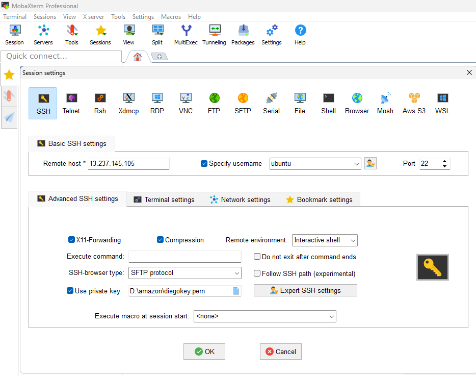
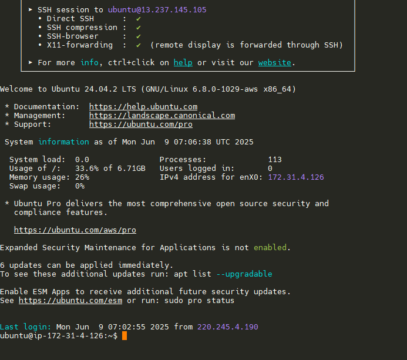
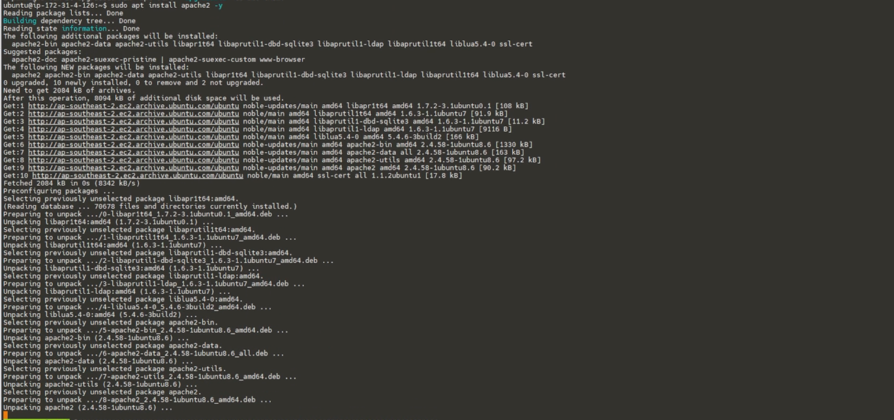

# Cloud Server Project: dptech.online

**Student:** Diego Pedraza  
**Student ID:** 35549445  
**Unit:** ICT171 - Server Environments and Architectures  
**Project Name:** DP IT Technology  
**Project Type:** Cloud-hosted IT services website with secure access
**Primary Domain:** https://dptech.online  
**Replica/Test Domain:** https://dptech2.online

## Table of Contents
1. [Project Purpose and Scope](#project-purpose-and-scope)
2. [Cloud Infrastructure Overview](#cloud-infrastructure-overview)
3. [Local Machine Setup](#local-machine-setup)
4. [Domain Configuration](#domain-configuration)
5. [Hosting Platform: Amazon EC2](#hosting-platform-amazon-ec2)
6. [SSH Connection](#ssh-connection)
7. [Apache-Server](#apache-server)
8. [Domain Registration and DNS Setup](#3-domain-registration-and-dns-setup)
9. [TLS Certificate Setup](#tls-certificate-setup-lets-encrypt)
10. [Website](#Website)
11. [Scripts](#Script)
12. [Cron Job Setup](#cron-job-setup)
13. [Total Cost of Ownership (TCO)](#total-cost-of-ownership-tco---3-year-analysis)
14. [Troubleshooting Guide](#troubleshooting-guide)
15. [Performance Monitoring](#performance-monitoring)
16. [Security Best Practices](#security-best-practices)
17. [Final Testing Checklist](#final-testing-checklist)
18. [Video](#Video)
19. [References](#references)

## Project Purpose and Scope

This cloud infrastructure project was built to create a fully functional IT services website **dptech.online** using AWS EC2 intended to emulate a live business environment. DPTech provides a variety of services including hardware repairs and replacement, virus removal, data retrieval, networking support and cloud IT consulting. The solution was designed to be full secure, cost-efficient and scalable with some automated processes to simulate a production quality cloud deployment. The scope included buying a domain, changing DNS records a domain registrar, launching a Linux EC2 instance, loading and configuring a web server, setting up TLS, writing a backup process, using cron to automate different processes and documenting a total cost of ownership over three years. Each of these tasks was performed in such a manner to create the most reproducible and releasable instance which would allow for the sever to be redeployed independently at a later date.

### Why Infrastructure as a Service (IaaS)?
This project specifically uses IaaS (AWS EC2) rather than Platform as a Service (PaaS) or Software as a Service (SaaS) to demonstrate:
- Full control over the server environment
- Manual configuration and deployment skills
- SSH access for direct server management
- Real-world server administration experience
- Complete understanding of the technology stack

### Documentation Approach
This documentation is designed to be:
- **Reproducible**: Another ICT171 student could rebuild this server without additional research
- **Complete**: All commands, configurations, and decisions are documented
- **Professional**: Written as technical documentation for IT staff
- **Practical**: Focused on real implementation

## Cloud Infrastructure Overview

| **Element** | **Detail** |
|-------------|------------|
| **Platform** | AWS EC2 – IaaS |
| **Instance Type** | t3.micro (Free Tier eligible) |
| **OS** | Ubuntu Server 24.04 LTS |
| **Main** | 3.107.180.255 (172.31.13.70 private IP)|
| **Test (with Elastic IP)** | 13.237.145.105 (172.31.4.126 private IP)|
| **Security Rules** | TCP: 22 (SSH), 80 (HTTP), 443 (HTTPS) |

## Local Machine Setup

- **Operating System**: Windows 11
- **Terminal Tool**: MobaXterm
- **SSH Key File**: D:\amazon\diegokey.pem
- **Website Files Folder**: D:\amazon\webEC2
- **Git Client**: GitHub Desktop
- **Git Files Folder**: D:\github\dptech-server

## Domain Configuration

Domains registered on [Namecheap](https://www.namecheap.com/) and configured as follows:

| **Domain** | **IP Address** | **SSL** | **Purpose** |
|------------|----------------|---------|-------------|
| dptech.online | 3.107.180.255 | ✅ | Main server |
| dptech2.online | 13.237.145.105 | ✅ | Replica Test server for documentation |

Both domains use A records pointing to their respective public Elastic IPs.

# Hosting Platform: Amazon EC2

Amazon EC2 (Elastic Compute Cloud) was selected for this project due to its flexibility, affordability, and industry relevance.

**Step-by-Step Configuration:**


Enter the page:

- http://aws.amazon.com/ec2/

Or console page:

- https://console.aws.amazon.com

- Logged into AWS Console and selected EC2 from the Services menu.
- Launched a new instance
- Name and tags, name: DiegoServer-EC2 (DiegoServer2-EC2 Replica Test server)
- using **Ubuntu Server 24.04 LTS (64-bit ARM)**.
- Chose **t3.micro** instance type under the free tier.
- Created a new key pair (diegokey.pem) and downloaded it securely.
- Set up the security group to allow incoming traffic on TCP ports:
  - 22 (SSH) for secure shell access
  - 80 (HTTP) for web access
  - 443 (HTTPS) for encrypted connections

# SSH Connection





- Used MobaXterm from Windows to SSH into the server:
- `ssh -i diegokey.pem ubuntu@3.107.180.255`

**Note:** For the test server used:
- `ssh -i diegokey.pem ubuntu@13.237.145.105`

### Key File Security in MobaXterm
```bash
# Set proper permissions for the key file
chmod 400 /drives/d/amazon/diegokey.pem

# Verify permissions
ls -la /drives/d/amazon/diegokey.pem
```

### First Connection Checklist
1. Ensure EC2 instance is running in AWS Console
2. Verify Security Group allows SSH (port 22) from your IP
3. Confirm key file has correct permissions (400)
4. Use correct username: `ubuntu` for Ubuntu Server

# Apache-Server




- Updated the package list and installed Apache web server:
- `sudo apt update`
- `sudo apt install apache2 -y`
- `sudo systemctl enable apache2`
- `sudo systemctl start apache2`
- Verified service with `systemctl status apache2` and accessed the default Apache landing page from a browser.

### Testing Apache Installation
1. **Local test**: `curl http://localhost`
2. **External test**: Navigate to `http://YOUR_EC2_IP` in that case 3.107.180.255 (Main Server) or 13.237.145.105 (Test Server)  in browser
3. **Check logs**: `sudo tail -f /var/log/apache2/access.log`

## Domain Registration and DNS Setup


- Purchased the domain dptech.online from Namecheap ($1.16 AUD/year).
- Purchased the domain dptech2.online from Namecheap ($1.16 AUD/year).
- Logged into Namecheap Dashboard > Domain List > Manage > Advanced DNS.
- **For dptech.online:**
  - Added A record: @ pointing to 3.107.180.255
  - Added A record: www pointing to 3.107.180.255
- **For dptech2.online (Test Server):**
  - Added A record: @ pointing to 13.237.145.105
  - Added A record: www pointing to 13.237.145.105
- Set TTL to Automatic for both domains.
- Confirmed DNS propagation using external DNS checkers and the following terminal commands:
- `dig dptech.online`
- `nslookup dptech.online`
- `wget http://dptech.online`
- `curl -Iv https://dptech.online`
- Full propagation occurred within approximately 15–20 minutes.

# TLS Certificate Setup (Let's Encrypt)


To enable secure connections:

- Ensured port 443 was open in the EC2 instance's security group.
- `wget http://dptech.online`
- `sudo apt update`
- `sudo apt install snapd -y`
- `sudo snap install core`
- `sudo snap refresh core`
- `sudo snap install --classic certbot`
- `sudo ln -s /snap/bin/certbot /usr/bin/certbot`
- `sudo certbot --apache`

```
Perform the following sub-actions when prompted:

In the Enter email address... field: enter the email address, die_fpp@hotmail.com was entered.

In "You mut agree in order to register with the ACME server. Do I agree?", answer (Y) is: Y

Next option, answer (No): N

Then in dptech2.online enter www.dptech2.online, which is a "Requesting a certificate for both."

And finally, choose 2: 00-default-le-ssl.conf, choose: 2
```

- Installed Snap and Certbot tools:
- `sudo snap install core`
- `sudo snap refresh core`
- `sudo snap install --classic certbot`
- `sudo ln -s /snap/bin/certbot /usr/bin/certbot`
- Installed the certificate with Apache integration:
- `sudo certbot --apache`
- Selected both domains during the prompt (dptech.online and www.dptech.online).
- Auto-redirect from HTTP to HTTPS was enabled.
- Verified certificate with browser (lock icon) and CLI tools:

# `curl -Iv https://dptech.online`


- Confirmed certificate was issued by Let's Encrypt and set to renew automatically.

# Website

 **Updating Files**

 Every time changes are made, this is the process of updating files from our main computer to the EC2 server, from the local terminal then in the Ubuntu terminal where the files are copied to the Ubuntu user folder and then to the /var/www/ destination.


**In MobaXterm terminal:**
```bash
cd /drives/d/amazon/webEC2/v2
chmod 400 /drives/d/amazon/diegokey.pem
scp -i /drives/d/amazon/diegokey.pem /drives/d/amazon/webEC2/v2/*.html ubuntu@3.107.180.255:/home/ubuntu/
scp -i /drives/d/amazon/diegokey.pem -r /drives/d/amazon/webEC2/v2/css ubuntu@3.107.180.255:/home/ubuntu/
```


**On the server via SSH:**
In summary

```bash
sudo mv /home/ubuntu/*.html /var/www/html/
sudo rm -r /var/www/html/css
sudo mv /home/ubuntu/css /var/www/html/
sudo chown -R www-data:www-data /var/www/html/
sudo systemctl reload apache2
```

**Website-Update**


- Cleaned the default contents of /var/www/html:
- `sudo rm /var/www/html/index.html`
- Uploaded custom HTML, CSS, and images using MobaXterm:
- `scp -i diegokey.pem index.html ubuntu@3.107.180.255:/var/www/html/`
- Verified file permissions and ownership:
- `sudo chown www-data:www-data /var/www/html/index.html`
- Reloaded Apache to confirm new content:
- `sudo systemctl reload apache2`
- Website loaded properly at https://dptech.online/.

### Website Design and Template Attribution

The frontend of the **dptech.online** website was developed using a customized HTML/CSS template based on the open-source Bootstrap template:

- **Source template**: [Business Frontpage – Start Bootstrap](https://startbootstrap.com/template/business-frontpage)  
- **License**: [MIT License](https://github.com/StartBootstrap/startbootstrap-business-frontpage/blob/master/LICENSE)

The template was adapted to match the branding and service structure of DPTech. This includes modified color schemes, HTML sections, and service categories.

### Icons Used

This project makes use of **Font Awesome Free Icons** to enhance visual clarity and modern design:

- [Font Awesome](https://fontawesome.com/)  
- **License**: Free icons are released under **Creative Commons Attribution 4.0** and **MIT License**

### DP IT Technology Services Summary

DP IT Technology is an independent IT solutions provider offering a comprehensive range of technical services including:

- **Support & Maintenance**  
  PC/Mac & Mobile Repair, Help Desk (Remote/On-site), Virus Removal & Optimization, Preventive Maintenance

- **Hardware & Assembly**  
  Custom PC Building, Component Upgrades, Hardware Diagnostics, Component Sales

- **Software & Data**  
  OS & Application Installation, Advanced Data Recovery, Secure Backup Solutions, Software Configuration

- **Networks & Infrastructure**  
  Network Design & Installation, Server Administration, Network Security (Firewalls, VPN), Structured Cabling

- **Additional Services**  
  Strategic IT Consulting, Technology Training, Cloud Solutions, Business IT Support

- **Contact Us**  
  Ready to help with your technology needs. Contact us for a free consultation!

# Script
## Script 1: Daily Status Report

### Objective
The `daily_status_report.sh` script is designed to generate a snapshot of the server's status including uptime, CPU and memory usage, and disk space. It stores the output in a timestamped file under `/home/ubuntu/server_reports/`.

### Step-by-step Instructions

1. Create the folder to store the reports

```bash
mkdir -p /home/ubuntu/server_reports
```

2. Create the script file

```bash
nano /home/ubuntu/daily_status_report.sh
```

3. Paste the following content

```bash
#!/bin/bash
# Script to generate server status report
# Author: Diego Pedraza
# This script creates comprehensive server status reports

NOW=$(date +"%Y-%m-%d_%H-%M")
REPORT="/home/ubuntu/server_reports/report_$NOW.txt"

echo "===== SERVER STATUS REPORT =====" > $REPORT
echo "Date and Time: $(date)" >> $REPORT
echo "-------------------------------" >> $REPORT
echo "Uptime:" >> $REPORT
uptime >> $REPORT
echo "" >> $REPORT
echo "CPU and Memory Usage:" >> $REPORT
top -b -n1 | head -n 10 >> $REPORT
echo "" >> $REPORT
echo "Disk Usage:" >> $REPORT
df -h >> $REPORT
echo "" >> $REPORT
echo "Free Memory:" >> $REPORT
free -h >> $REPORT
echo "" >> $REPORT
echo "Top 5 Processes by Memory Usage:" >> $REPORT
ps aux --sort=-%mem | head -n 5 >> $REPORT

echo "Report saved to: $REPORT"
```

Use `Ctrl + O` to save and `Ctrl + X` to exit.

4. Make the script executable

```bash
chmod +x /home/ubuntu/daily_status_report.sh
```

5. Test the script manually

```bash
/home/ubuntu/daily_status_report.sh
```

Verify the result in:

```bash
ls -la /home/ubuntu/server_reports/
```

6. Make the script system-wide

```bash
sudo mv /home/ubuntu/daily_status_report.sh /usr/bin/daily_status_report
sudo chown ubuntu /usr/bin/daily_status_report
```

Now you can run it from any location with:

```bash
daily_status_report
```

## Script 2: Apache Monitor

### Objective
This script checks whether the Apache service (apache2) is active. If it's not running, it automatically restarts the service and logs the event. It's useful for keeping your website always online without requiring manual checks.

### Step-by-step Instructions

1. Create the log directory

```bash
mkdir -p /home/ubuntu/apache_logs
```

2. Create the script file

```bash
nano /home/ubuntu/apache_monitor.sh
```

3. Paste the following content

```bash
#!/bin/bash
# Apache Monitoring Script
# Author: Diego Pedraza
# Monitors Apache service and automatically restarts if needed

LOGFILE="/home/ubuntu/apache_logs/apache_monitor.log"
TIMESTAMP=$(date +"%Y-%m-%d %H:%M:%S")

echo "[$TIMESTAMP] Checking Apache service..." >> $LOGFILE

# Check if Apache is active
if systemctl is-active --quiet apache2
then
    echo "[$TIMESTAMP] Apache is running." >> $LOGFILE
else
    echo "[$TIMESTAMP] Apache is NOT running. Restarting..." >> $LOGFILE
    sudo systemctl start apache2
    if systemctl is-active --quiet apache2
    then
        echo "[$TIMESTAMP] Apache successfully restarted." >> $LOGFILE
    else
        echo "[$TIMESTAMP] Failed to restart Apache!" >> $LOGFILE
    fi
fi
```

Save with `Ctrl + O`, then exit with `Ctrl + X`.

4. Make the script executable

```bash
chmod +x /home/ubuntu/apache_monitor.sh
```

5. Test it manually

First stop the service (just for testing):

```bash
sudo systemctl stop apache2
```

Then run the script:

```bash
/home/ubuntu/apache_monitor.sh
```

Check the log with:

```bash
cat /home/ubuntu/apache_logs/apache_monitor.log
```

6. Make it system-wide (optional)

```bash
sudo mv /home/ubuntu/apache_monitor.sh /usr/bin/apache_monitor
sudo chown ubuntu /usr/bin/apache_monitor
```

Now you can run it from anywhere:

```bash
apache_monitor
```

### Scripts Summary
These two scripts demonstrate automation capabilities on the server:
- **daily_status_report**: Provides comprehensive system health monitoring
- **apache_monitor**: Ensures website availability through automatic service recovery

Both scripts can be scheduled via cron for fully automated operation.

# Cron Job Setup

- Opened crontab:
- `sudo nano /etc/crontab`
- Added the following entries:
- `0 * * * * ubuntu /usr/bin/daily_status_report`
- `*/5 * * * * ubuntu /usr/bin/apache_monitor`
- Checked cron logs to verify automatic execution
- Confirmed scripts are running automatically as scheduled

# Clarification on Dual Domains

**Important Note:** The screenshots and video documentation come from the test server (dptech2.online) as the original production server (dptech.online) was deployed in Assignment 1 and has been continuously run since then without documentation of the setup process.

- **dptech.online – Primary website hosted on an EC2 instance (IP: 3.107.180.255) deployed in Assignment 1. Since I did not create an Elastic IP, I have not restarted or shut down the server, to avoid losing the IP registered in Assignment1.**
- **dptech2.online – Mirror server created for video and documentation purposes, using Elastic IP (13.237.145.105).**

**The two domains are nearly identical in functionality and configuration. The test server was created to properly record the setup steps which were missed initially on the main instance.**

# Total Cost of Ownership (TCO) - 3 Year Analysis

## Three-Year Cost Summary

| Platform | Year 1 | Year 2 | Year 3 | 3-yr Grand Total |
|----------|--------|--------|--------|------------------|
| On-Prem | $10,094 | $3,116 | $3,240 | $16,450 |
| Cloud Platform (IaaS) | $1,344 | $1,385 | $1,426 | $4,155 |
| Web Platform (SaaS) | $862 | $888 | $915 | $2,665 |

## Cloud Platform (IaaS) - Cost Breakdown (AUD)

AWS EC2 (Amazon Elastic Compute Cloud) is a web service that provides secure, resizable compute capacity in the cloud. It is designed to make web-scale cloud computing easier for developers.

| Cost Bucket | Year 1 | Year 2 | Year 3 | 3-yr Sub-Total |
|-------------|--------|--------|--------|----------------|
| Compute (t3.small 0.0408 AUD/h, +3%) | $357 | $368 | $379 | $1,104 |
| Storage (gp3 100 GB, +3%) | $61 | $63 | $65 | $189 |
| Daily Snapshots (30 GB, +3%) | $298 | $307 | $316 | $921 |
| Data Transfer (100 GB/mo @ $0.12/GB, +3%) | $154 | $159 | $164 | $477 |
| Route 53 + Domain | $49 | $49 | $49 | $147 |
| DevOps Labour (6h @ $55, +3%) | $330 | $340 | $350 | $1,020 |
| Contingency 10% (Opex) | $95 | $99 | $103 | $297 |
| **IaaS Annual Total** | **$1,344** | **$1,385** | **$1,426** | **$4,155** |

## On-Prem (Dell R550) - Cost Breakdown (AUD)

| Cost Bucket | Year 1 | Year 2 | Year 3 | 3-yr Sub-Total |
|-------------|--------|--------|--------|----------------|
| CapEx (server + UPS + FW) | $7,006 | $- | $- | $7,006 |
| Rack & Cooling | $300 | $318 | $337 | $955 |
| Power (250W avg @ $0.30 kWh, +6%) | $657 | $697 | $739 | $2,093 |
| Software (cPanel $60 / Acronis 120, +3%) | $420 | $433 | $446 | $1,299 |
| Domain + DNS | $26 | $27 | $27 | $80 |
| IT Staff (0.5 FTE @ $85, +3%) | $1,320 | $1,360 | $1,401 | $4,081 |
| Contingency 10% (Opex) | $272 | $281 | $290 | $843 |
| **On-Prem Annual Total** | **$10,094** | **$3,116** | **$3,240** | **$16,450** |

## Web Platform (SaaS) - Cost Breakdown (AUD)

WordPress.com is a hosted Software as a Service (SaaS) platform that allows users to create and manage websites and blogs without needing to manage the underlying server infrastructure, security, or software updates.

| Cost Bucket | Year 1 | Year 2 | Year 3 | 3-yr Sub-Total |
|-------------|--------|--------|--------|----------------|
| Plan Subscription (US$15/mo, +3%) | $286 | $274 | $292 | $822 |
| Media Overage (10 GB/yr @ $1.20/GB, +6%) | $12 | $13 | $14 | $39 |
| Domain (internal) | $26 | $27 | $27 | $80 |
| Content Manager (10/mo @ $40, +3%) | $480 | $494 | $509 | $1,483 |
| Contingency 10% (Opex) | $78 | $80 | $83 | $241 |
| **SaaS Annual Total** | **$862** | **$888** | **$915** | **$2,665** |

# Final Testing Checklist

✅ DNS resolves and A records confirmed  
✅ Apache Web Server fully operational  
✅ HTTPS enabled with valid certificate  
✅ Website content deployed successfully  
✅ Backup script tested manually and via cron  
✅ Files timestamped correctly with zip format  
✅ Server secure, ports configured properly  
✅ Platform aligns with real-world IT business simulation

## Troubleshooting Guide

### Common Issues and Solutions

#### SSH Connection Issues
```bash
# Error: Permission denied (publickey)
# Solution: Check key file permissions in terminal in (my case used MobaXterm)
chmod 400 /drives/d/amazon/diegokey.pem

# Error: Connection timeout
# Solution: Verify security group allows SSH from your IP
# Check AWS Console > EC2 > Security Groups > Inbound Rules
```

#### DNS Not Resolving
```bash
# Check DNS propagation status
dig dptech.online @8.8.8.8
nslookup dptech.online

# If not resolving after 30 minutes:
# 1. Verify A records in Namecheap dashboard
# 2. Check IP address is correct
# 3. Clear local DNS cache
```

#### Apache Issues
```bash
# Apache not starting
sudo systemctl status apache2
sudo journalctl -xe | grep apache2

# Check for configuration errors
sudo apache2ctl configtest

# Common fix: Another service using port 80
sudo netstat -tulpn | grep :80
```

#### SSL Certificate Problems
```bash
# Certificate not working
sudo certbot certificates

# Force renewal if needed
sudo certbot renew --force-renewal

# Check Apache SSL module
sudo a2enmod ssl
sudo systemctl restart apache2
```

#### Website Not Loading
```bash
# Check file permissions
ls -la /var/www/html/
# Files should be owned by www-data

# Fix permissions if needed
sudo chown -R www-data:www-data /var/www/html/
sudo chmod -R 755 /var/www/html/

# Check Apache error logs
sudo tail -f /var/log/apache2/error.log
```

## Performance Monitoring

### System Resource Monitoring
```bash
# Real-time system monitoring
htop

# Disk usage
df -h

# Memory usage
free -m

# Apache connections
sudo netstat -anp | grep :80 | wc -l

# Apache status module (if enabled)
sudo a2enmod status
sudo systemctl restart apache2
```

### Log Analysis
```bash
# Monitor Apache access logs
sudo tail -f /var/log/apache2/access.log

# Check for errors
sudo tail -f /var/log/apache2/error.log

# System logs
sudo journalctl -f
```

## Security Best Practices

### Server Hardening Steps Implemented
1. **SSH Security**
   - Key-based authentication only
   - Password authentication disabled
   - Root login disabled

2. **Firewall Configuration**
   - Only necessary ports open (22, 80, 443)
   - Security groups properly configured

3. **Regular Updates**
   ```bash
   sudo apt install
   ```

4. **SSL/TLS Configuration**
   - HTTPS enforced with redirect
   - Strong cipher suites
   - Regular certificate renewal

5. **File Permissions**
   - Proper ownership for web files
   - Restricted access to sensitive files
   - Regular permission audits

### Backup Best Practices
- Automated daily backups via cron
- Timestamped archives for version history
- Optional off-site backup capability
- Regular backup testing and verification

## Video


### Video Content Overview
The video demonstration covers:
1. Live server functionality demonstration
2. SSH connection process
3. Apache configuration walkthrough
4. SSL certificate verification
5. Backup script execution
6. Website navigation and features

## References

1. **AWS EC2 Documentation**: https://docs.aws.amazon.com/ec2/
2. **Ubuntu Server Guide**: https://ubuntu.com/server/docs
3. **Apache HTTP Server Documentation**: https://httpd.apache.org/docs/2.4/
4. **Let's Encrypt Getting Started**: https://letsencrypt.org/getting-started/
5. **Namecheap DNS Setup Guide**: https://www.namecheap.com/support/knowledgebase/article.aspx/319/2237/
6. **MobaXterm Documentation**: https://mobaxterm.mobatek.net/documentation.html
7. **Bootstrap.**: https://startbootstrap.com/template/business-frontpage
8. **Font Awesome**: https://fontawesome.com/license/free


---

**Last Updated:** June 2025  
**Assignment Submission:** ICT171 - Murdoch University